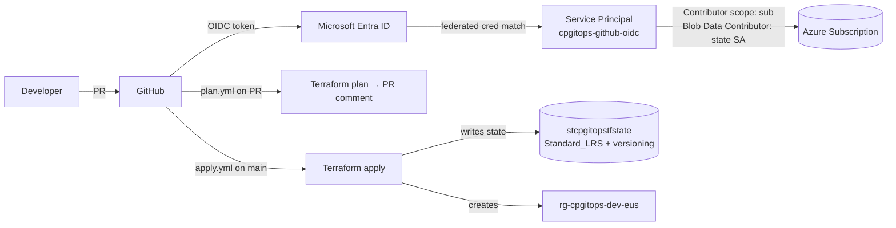

# cloud-platform-gitops

Personal Azure platform-engineering playground built the way an enterprise team would run it: **Terraform + Bicep, GitOps-driven, OIDC-only, zero secrets in the repo.**

Everything runs on a pay-as-you-go subscription with strict cost guardrails (see [`.github/copilot-instructions.md`](.github/copilot-instructions.md)).

---

## What this repo demonstrates

- 🔐 **Passwordless CI → Azure auth** via GitHub OIDC + Entra federated credentials (no client secrets, no PATs).
- 🚦 **GitOps flow:** `terraform plan` on PR (with plan comment), `terraform apply` on merge to `main`, `prod` gated by required reviewer.
- 🏷️ **CAF-compliant naming & mandatory tags** (`env`, `workload`, `owner`, `costCenter`, `managedBy`) centralised in one `locals.tf`.
- 💰 **Cost-first defaults** — Free/Basic tiers, `Standard_LRS`, no public IPs, no premium SKUs, teardown documented.
- 🧱 **Two IaC tools side-by-side** — Terraform (root of truth) and Bicep (comparison / AVM modules).
- 📓 **ADRs + runbooks** for every non-obvious decision.

---

## Architecture (high level)



See [`docs/ARCHITECTURE.md`](docs/ARCHITECTURE.md) for the deeper diagram (OIDC trust chain, state layout, environment strategy).

---

## Repo layout

```
.github/workflows/    # CI: oidc-smoke, terraform-plan, terraform-apply
bicep/                # Bicep equivalent (WIP)
docs/
  ARCHITECTURE.md
  adr/                # Architecture Decision Records
  runbooks/           # OIDC bootstrap, etc.
scripts/              # One-off bootstrap scripts (OIDC)
terraform/            # Root module + child modules
  modules/
    azure-ad-app/
    dns-record/
    github-repo/
```

---

## Prerequisites

| Tool | Version | Install |
|---|---|---|
| Azure CLI | ≥ 2.65 | `winget install Microsoft.AzureCLI` |
| Terraform | 1.15.8 | `winget install Hashicorp.Terraform` |
| GitHub CLI | ≥ 2.55 | `winget install GitHub.cli` |
| PowerShell | 5.1 or 7+ | built-in / `winget install Microsoft.PowerShell` |

Plus:
- An Azure subscription (Pay-As-You-Go used here).
- Fork/clone this repo. **The GitHub repo must be public** on GitHub Free if you want environment protection rules.

---

## Quickstart (fork & run yourself)

> First-time setup only. All subsequent changes flow through PRs.

1. **Bootstrap OIDC** — one-time. Creates the state Storage Account, the Entra app, federated credentials, and RBAC.
   See [`docs/runbooks/oidc-bootstrap.md`](docs/runbooks/oidc-bootstrap.md).

2. **Set GitHub repo variables** (not secrets):
   - `AZURE_CLIENT_ID`
   - `AZURE_TENANT_ID`
   - `AZURE_SUBSCRIPTION_ID`

3. **Set up GitHub environments** `dev` and `prod` (Settings → Environments).
   Add a required reviewer to `prod`.

4. **Open a PR** touching `terraform/**` — the `terraform-plan` workflow runs and posts the plan as a PR comment.

5. **Merge to `main`** — the `terraform-apply` workflow creates resources in `dev`.

6. **Verify:**
   ```powershell
   az group show -n rg-cpgitops-dev-eus --query "{name:name, tags:tags}" -o jsonc
   ```

---

## Local development

**Allowed locally:** `fmt`, `validate`, `plan` (read-only).
**Forbidden locally:** `apply`, `destroy` — always through CI.

```powershell
cd terraform
terraform init
terraform fmt -recursive
terraform validate
terraform plan -var environment=dev -out=tfplan   # inspect only, do NOT apply
Remove-Item tfplan
```

---

## Cost stance

Every resource in this repo is chosen to sit in Azure's free or minimum-cost tier. Current running cost of a fully-applied `dev`:

| Resource | SKU | Est. cost |
|---|---|---|
| Resource Group | n/a | Free |
| Storage Account (tfstate) | `Standard_LRS`, StorageV2 | ~$0.02 / GB / month |
| App Service (planned) | `F1` Free | Free |
| Key Vault (planned) | `standard` | ~$0.03 / 10 k ops |
| Log Analytics (planned) | `PerGB2018`, 0.1 GB cap, 30-day retention | ~$0 at learning volume |

**Teardown when done for the day:**
```powershell
az group delete --name rg-cpgitops-dev-eus --yes --no-wait
# tfstate SA stays intact (it's in rg-cpgitops-tfstate)
```

---

## Design decisions (ADRs)

- [ADR-0001](docs/adr/0001-oidc-over-secrets.md) — Use OIDC federated credentials, not service principal secrets
- [ADR-0002](docs/adr/0002-plan-on-pr-apply-on-merge.md) — Plan on PR, apply on merge to main
- [ADR-0003](docs/adr/0003-caf-naming-and-mandatory-tags.md) — CAF naming convention + 5 mandatory tags

---

## Status

| Component | Status |
|---|---|
| OIDC bootstrap | ✅ Done |
| Terraform root (RG only) | ✅ Deployed to `dev` |
| Terraform CI (plan/apply) | ✅ Green |
| Terraform child modules | ⏳ WIP |
| Bicep equivalent | ⏳ Not started |
| Policy (deny public IP, require tags) | ⏳ Not started |

---

## License

MIT — see [LICENSE](LICENSE) if present, otherwise treat as public-domain sample code.

---

<sub>📝 This document was drafted with the help of an AI assistant (GitHub Copilot) and reviewed by the repo owner. Content reflects the actual state of the repository at the time of writing.</sub>
