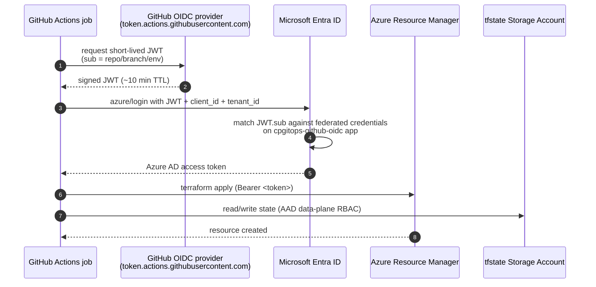
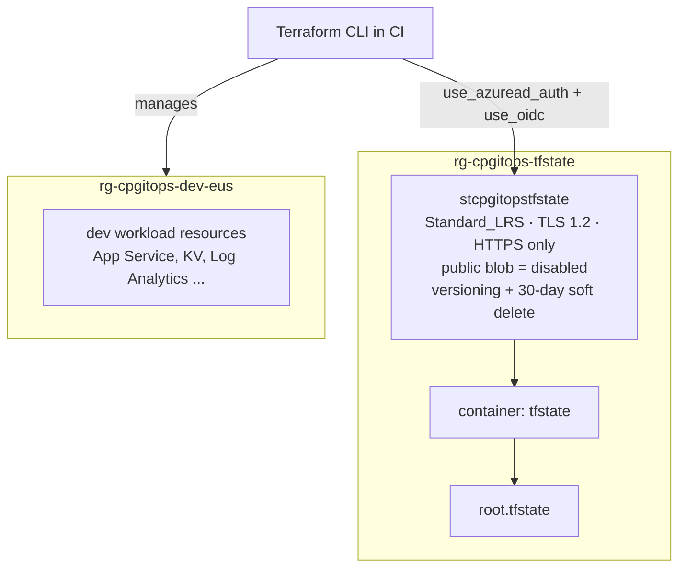
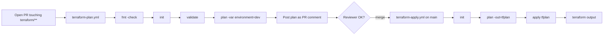

# Architecture

Deeper view of how the pieces fit together. High-level summary is in the [README](../README.md).

---

## OIDC trust chain

How a GitHub Actions job authenticates to Azure without a stored secret:



**Key properties:**
- Token never at rest. Fresh JWT per job.
- Subject-based trust — a stolen client_id is useless without matching the exact `sub` claim.
- Data-plane RBAC on the state SA — no storage account keys anywhere.

---

## Federated credentials (subjects registered on the Entra app)

Each row = one federated credential on the `cpgitops-github-oidc` app.

| Purpose | Subject | Used by |
|---|---|---|
| Merges to `main` | `repo:mpattar0@<orgId>/cloud-platform-gitops@<repoId>:ref:refs/heads/main` | `terraform-apply.yml` on push to main |
| PR jobs | `repo:...:pull_request` | `terraform-plan.yml` on PRs |
| `dev` deploys | `repo:...:environment:dev` | apply job when `environment: dev` |
| `prod` deploys | `repo:...:environment:prod` | apply job when `environment: prod` (reviewer-gated) |

Immutable-subject format (org ID + repo ID) is required by new Entra tenants.

---

## RBAC assignments

Principle: least privilege, scoped as narrowly as practical.

| Assignee | Role | Scope | Why |
|---|---|---|---|
| SP `cpgitops-github-oidc` | Contributor | Subscription | Terraform needs to create RGs and any resource inside them. Interview-safe answer: "in a real landing zone I'd scope to a management group and split into per-workload SPs." |
| SP `cpgitops-github-oidc` | Storage Blob Data Contributor | `stcpgitopstfstate` only | Data-plane access to read/write the state blob without SA keys. |

---

## State management



- **Backend:** `azurerm` with `use_azuread_auth = true`, `use_oidc = true`.
- **Locking:** built-in blob lease. `terraform-plan` cancels stale runs; `terraform-apply` never cancels mid-flight.
- **Versioning + soft delete** on the state blob = accidental deletion recovery.
- **Isolation:** state SA is in its own RG so a dev teardown (`az group delete rg-cpgitops-dev-eus`) never nukes state.

---

## Environment strategy

| Env | Trigger | Approval | Notes |
|---|---|---|---|
| `dev` | Merge to `main` (auto) | None | Fast feedback. Free-tier SKUs only. |
| `prod` | `workflow_dispatch` (manual) | Required reviewer via GitHub environment | Same code path, different `-var environment=prod`. |

Both share the **same state file** (`root.tfstate`) for now because the workload is single-tenant. When resources start to differ per env, we'll switch to Terraform workspaces or per-env state keys.

---

## Naming convention (CAF)

Every resource name is generated in `terraform/locals.tf` from three inputs:

```
{type}-{prefix}-{env}-{regionShort}
```

Examples:

| Type | Example |
|---|---|
| Resource group | `rg-cpgitops-dev-eus` |
| Key Vault | `kv-cpgitops-dev-eus` |
| Log Analytics workspace | `log-cpgitops-dev-eus` |
| App Service plan | `asp-cpgitops-dev-eus` |
| App Service | `app-cpgitops-dev-eus` |
| Storage Account | `stcpgitopsdeveus` (dashes stripped, lowercased) |

`check` blocks in `locals.tf` fail `terraform plan` early if any generated name exceeds Azure's per-type limits (Key Vault ≤ 24 chars, Storage Account 3-24 alphanumeric).

---

## Mandatory tags

Every resource gets these 5 tags from `local.common_tags`:

| Tag | Value example | Purpose |
|---|---|---|
| `env` | `dev` / `prod` | Cost slicing, policy targeting |
| `workload` | `cpgitops` | Workload attribution |
| `owner` | `Mounesh Pattar` | Incident routing |
| `costCenter` | `learning` | Chargeback |
| `managedBy` | `terraform` | Prevents ClickOps drift ("who created this?") |

An Azure Policy `require-tags` (planned, PR #9) will deny resource creation missing any of these.

---

## CI pipeline (Terraform)



Notes:
- The apply workflow re-plans against latest state on `main` before applying — prevents "plan approved yesterday, state changed today" surprises.
- `concurrency: cancel-in-progress: true` on plan (safe to cancel), `false` on apply (never kill mid-apply).
- `prod` runs are triggered manually via `workflow_dispatch`; the GitHub environment gate enforces reviewer approval.

---

## Cost model

The subscription is Pay-As-You-Go. Guardrails are enforced by convention (copilot instructions) and will be enforced by policy in PR #9. Approximate steady-state monthly cost when `dev` is fully applied:

| Resource | SKU | Approx. monthly cost |
|---|---|---|
| Resource group | — | Free |
| Storage Account (state) | `Standard_LRS` | ~$0.02 per GB stored |
| App Service (planned) | `F1` Free | $0 |
| Key Vault (planned) | `standard`, RBAC auth | ~$0.03 / 10k ops (typically <$0.10) |
| Log Analytics (planned) | `PerGB2018`, 0.1 GB cap, 30 d retention | ~$0 at learning volume |

Teardown zeroes cost except the state SA (kept intact so history is preserved).

---

## Future roadmap (see `PROGRESS.md`)

- PR #5 — Terraform child modules (`azure-ad-app`, `github-repo`, `dns-record`).
- PR #6 — Bicep parallel using AVM modules.
- PR #7 — Bicep CI (what-if on PR, deploy on main).
- PR #9 — Policy (`deny-public-ip`, `require-tags`, `allowed-locations`).
- PR #10 — Team manifest schema + validator.
- Dependabot for GitHub Actions + Terraform providers.
- `tflint` + `tfsec` in plan workflow.

---

<sub>📝 This document was drafted with the help of an AI assistant (GitHub Copilot) and reviewed by the repo owner. Content reflects the actual state of the repository at the time of writing.</sub>
