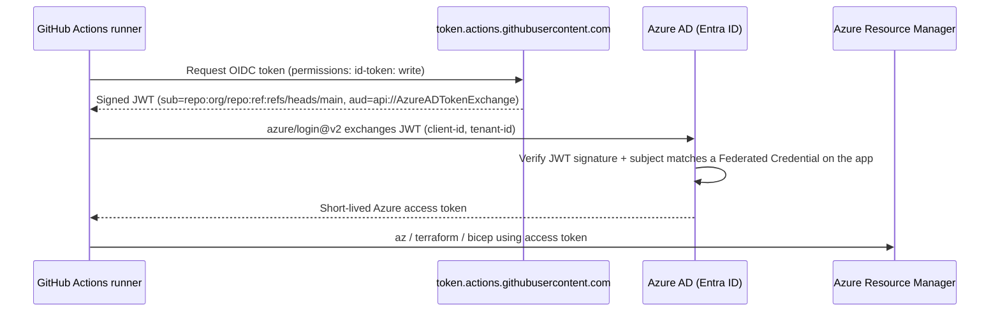

# OIDC Bootstrap — GitHub Actions → Azure (passwordless)

> **Goal:** enable GitHub Actions in this repo to deploy to Azure using
> **OpenID Connect (OIDC) federated credentials** — zero long-lived secrets.
>
> **Audience:** interview prep + repeatable runbook.
> **Cost:** everything below is **free** except the tfstate storage account
> (~$0.02/month for a few KB of state).

---

## 1. Concepts (interview-ready)

### Why OIDC over service principal secrets?

| Concern                | Client secret / SP password           | OIDC federated credentials             |
| ---------------------- | ------------------------------------- | -------------------------------------- |
| Long-lived credential? | Yes (expires, must rotate)            | **No** — short-lived JWT per run       |
| Stored in GitHub?      | Yes, as an encrypted repo secret      | **No** — only client/tenant/sub IDs    |
| Blast radius if leaked | Full SP access until rotated          | Cannot be leaked (never exists at rest)|
| Scoping                | All-or-nothing                        | Per repo / branch / env / PR           |
| Rotation               | Manual, painful                       | Not applicable                         |

### How does it work?



### Key entities

| Entity                              | Purpose                                                                 |
| ----------------------------------- | ----------------------------------------------------------------------- |
| **AAD Application (app registration)** | Global identity definition. Holds federated credentials.              |
| **Service principal (SP)**          | Per-tenant instance of the app. Holds RBAC role assignments.            |
| **Federated credential (FIC)**      | Trust rule: "accept OIDC tokens whose `sub` matches this pattern."      |
| **Subject (`sub`) claim**           | GitHub-issued, uniquely identifies workflow context (repo/branch/env).  |
| **Audience (`aud`) claim**          | Must equal `api://AzureADTokenExchange` (what `azure/login@v2` sends).  |

### Federated credential subject patterns

| Trigger                                 | Subject pattern                                    |
| --------------------------------------- | -------------------------------------------------- |
| Push to `main`                          | `repo:<org>/<repo>:ref:refs/heads/main`            |
| Push to any tag                         | `repo:<org>/<repo>:ref:refs/tags/*`                |
| Pull request                            | `repo:<org>/<repo>:pull_request`                   |
| GitHub environment `dev` / `prod`       | `repo:<org>/<repo>:environment:<name>`             |
| Workflow file (advanced, GH-preview)    | `repo:<org>/<repo>:job_workflow_ref:...`           |

### Trade-offs / interview follow-ups

- **Why 4 FICs and not 1 wildcard?** Wildcards need `claims_matching_expression` (newer, less portable). Explicit subjects = clearest security posture.
- **Why subscription-scope Contributor here?** Personal learning subscription. Enterprise: scope to management group / RG per env, split apply-vs-plan SPs, use JIT with PIM.
- **Why data-plane RBAC (Storage Blob Data Contributor) instead of storage keys?** Storage keys are shared secrets and can't be scoped. Data-plane RBAC is per-identity, auditable, revokable.
- **Can we avoid *any* Azure identity?** No — but we can further isolate by using `id-token: write` only on jobs that need it, plus GitHub environment protection rules with required reviewers.

---

## 2. Prerequisites

- Azure CLI (`az`) installed and logged in to the correct tenant.
- Owner / User Access Administrator on the target subscription (needed to create role assignments).
- GitHub repo already created and pushed at least once (federated credential validation checks the `sub` claim, not the repo, so it works even before code is pushed).

```powershell
az version
az account show --output table   # verify subscription + tenant
```

---

## 3. Variables (single source of truth)

```powershell
$Prefix     = "cpgitops"
$Location   = "eastus"
$GhOrgRepo  = "MouneshPattar/cloud-platform-gitops"     # <org>/<repo>
$SubId      = az account show --query id -o tsv
$TenantId   = az account show --query tenantId -o tsv

$RgTfState  = "rg-$Prefix-tfstate"
$SaTfState  = ("st" + $Prefix + "tfstate").ToLower()    # 3-24 chars, lowercase alnum
$Container  = "tfstate"
$AadAppName = "$Prefix-github-oidc"
```

---

## 4. Terraform state backend (storage)

Enterprise-safe defaults: `Standard_LRS` (cheapest), TLS 1.2, HTTPS-only, no
public blob access, blob **versioning** + 30-day **soft delete** to protect state.

```powershell
az group create --name $RgTfState --location $Location `
  --tags purpose=tfstate managedBy=bootstrap

az storage account create `
  --name $SaTfState `
  --resource-group $RgTfState `
  --location $Location `
  --sku Standard_LRS `
  --kind StorageV2 `
  --min-tls-version TLS1_2 `
  --allow-blob-public-access false `
  --https-only true

az storage account blob-service-properties update `
  --account-name $SaTfState `
  --resource-group $RgTfState `
  --enable-versioning true `
  --enable-delete-retention true `
  --delete-retention-days 30

az storage container create `
  --name $Container `
  --account-name $SaTfState `
  --auth-mode login
```

---

## 5. Azure AD app + service principal

```powershell
$AppId      = az ad app create --display-name $AadAppName --query appId -o tsv
az ad sp create --id $AppId | Out-Null
$SpObjectId = az ad sp show --id $AppId --query id -o tsv
```

- **`AppId`** (aka client ID) → later becomes GitHub var `AZURE_CLIENT_ID`.
- **`SpObjectId`** → used for role assignments (safer than name lookup).

---

## 6. RBAC role assignments

Least-privilege pattern: broad **management-plane** role for Terraform to create
resources, narrow **data-plane** role only on the state storage account.

```powershell
# Management plane: Contributor on subscription (personal-learning scope)
az role assignment create `
  --assignee-object-id $SpObjectId `
  --assignee-principal-type ServicePrincipal `
  --role "Contributor" `
  --scope "/subscriptions/$SubId"

# Data plane: only tfstate SA, so SP can read/write state via AAD (no keys)
$SaScope = az storage account show --name $SaTfState --resource-group $RgTfState --query id -o tsv
az role assignment create `
  --assignee-object-id $SpObjectId `
  --assignee-principal-type ServicePrincipal `
  --role "Storage Blob Data Contributor" `
  --scope $SaScope
```

> **Enterprise variant:** replace subscription-Contributor with per-RG
> Contributor + Storage Blob Data Contributor on state SA + explicit RBAC on
> Key Vault (Key Vault Secrets Officer) via Terraform-managed role assignments.
> Add `User Access Administrator` **only** if the SP itself grants RBAC.

---

## 7. Federated credentials

Four narrow trust rules covering the common workflow triggers:

```powershell
function New-Fic($name, $subject) {
  $body = @{
    name      = $name
    issuer    = "https://token.actions.githubusercontent.com"
    subject   = $subject
    audiences = @("api://AzureADTokenExchange")
  } | ConvertTo-Json -Compress
  az ad app federated-credential create --id $AppId --parameters $body | Out-Null
  "Added FIC: $name  ->  $subject"
}

New-Fic "github-main"         "repo:$GhOrgRepo`:ref:refs/heads/main"
New-Fic "github-pull-request" "repo:$GhOrgRepo`:pull_request"
New-Fic "github-env-dev"      "repo:$GhOrgRepo`:environment:dev"
New-Fic "github-env-prod"     "repo:$GhOrgRepo`:environment:prod"

az ad app federated-credential list --id $AppId `
  --query "[].{name:name, subject:subject}" -o table
```

The `` ` `` before `:` escapes the colon so PowerShell doesn't parse it as a
drive/variable qualifier.

---

## 8. Configure GitHub (repo/environment variables)

Add these as **repository variables** (Settings → Secrets and variables →
Actions → *Variables* tab — not secrets, they're not sensitive):

| Variable                | Value             |
| ----------------------- | ----------------- |
| `AZURE_CLIENT_ID`       | `$AppId`          |
| `AZURE_TENANT_ID`       | `$TenantId`       |
| `AZURE_SUBSCRIPTION_ID` | `$SubId`          |

Also create GitHub **environments** `dev` and `prod` (Settings → Environments),
add **required reviewers** on `prod`, and optionally lock deploy to `main`.

---

## 9. Reference workflow (proof of life)

`.github/workflows/oidc-smoke.yml`:

```yaml
name: OIDC smoke test
on: { workflow_dispatch: {} }

permissions:
  id-token: write        # required to request the OIDC token
  contents: read

jobs:
  whoami:
    runs-on: ubuntu-latest
    steps:
      - uses: azure/login@v2
        with:
          client-id:       ${{ vars.AZURE_CLIENT_ID }}
          tenant-id:       ${{ vars.AZURE_TENANT_ID }}
          subscription-id: ${{ vars.AZURE_SUBSCRIPTION_ID }}
      - run: az account show -o table
```

Run it from the Actions tab → **Run workflow**. Green = OIDC works end-to-end.

---

## 10. Terraform backend snippet

`terraform/backend.tf`:

```hcl
terraform {
  backend "azurerm" {
    resource_group_name  = "rg-cpgitops-tfstate"
    storage_account_name = "stcpgitopstfstate"
    container_name       = "tfstate"
    key                  = "dev.terraform.tfstate"   # per-env key
    use_azuread_auth     = true                       # data-plane RBAC, no keys
    use_oidc             = true                       # SP authenticates via OIDC
  }
}
```

In CI, `azure/login@v2` populates `ARM_CLIENT_ID`, `ARM_TENANT_ID`,
`ARM_SUBSCRIPTION_ID`, and `ARM_USE_OIDC=true` for the `azurerm` provider.

---

## 11. Verification checklist

- [ ] `az ad app federated-credential list --id $AppId -o table` shows 4 FICs.
- [ ] `az role assignment list --assignee $AppId -o table` shows both roles.
- [ ] OIDC smoke workflow runs green.
- [ ] `terraform init` in CI succeeds (proves data-plane RBAC on SA works).

---

## 12. Teardown (cost hygiene)

```powershell
az group delete --name $RgTfState --yes --no-wait
az ad app delete --id $AppId
```

Federated credentials, role assignments, and the SP are cleaned up when the app
is deleted.

---

## 13. Common interview questions

1. **"Walk me through how a GitHub Actions job authenticates to Azure without a secret."**
   → OIDC diagram in §1, mention `id-token: write`, `sub` claim, FIC match, JWT exchange.
2. **"How would you scope this for production?"**
   → Split apply/plan SPs, per-RG Contributor, PIM/JIT, environment protection with reviewers, deployment branch policy `main` only.
3. **"What happens if someone forks the repo and runs the workflow?"**
   → GitHub's `sub` claim contains the *original* repo path only for workflows in that repo. Forks generate `pull_request` events whose `sub` is `repo:<fork-owner>/<repo>:pull_request` — will not match your FIC.
4. **"How do you rotate credentials?"**
   → You don't. FICs never contain secrets; rotation = update the subject or replace the FIC.
5. **"Why not use `azure/login@v1` with `creds` JSON?"**
   → `creds` = long-lived client secret. Anti-pattern.
6. **"How do you protect the state file?"**
   → Standard_LRS + versioning + soft delete + data-plane RBAC + separate RG + storage account firewall (add later) + no shared key access (`--allow-shared-key-access false` — future hardening).
7. **"What is `api://AzureADTokenExchange`?"**
   → The audience Entra ID expects on incoming federated JWTs. `azure/login@v2` sets it automatically.

---

## 14. Hardening backlog (post-MVP)

- Disable storage account shared-key access: `--allow-shared-key-access false`.
- Add storage account firewall + Private Endpoint (adds ~$7/mo — skip for now).
- Split into two SPs: `plan` (Reader + read state) and `apply` (Contributor + write state).
- Add `job_workflow_ref` FIC pinning the exact reusable workflow SHA.
- Enable Entra ID Conditional Access on the app for workload identity.
- Terraform state locking via blob lease (default with azurerm backend) — verify in CI logs.
